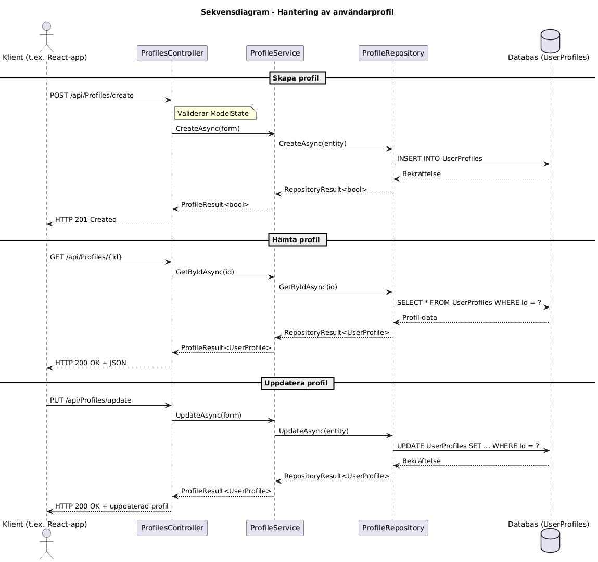

# Profile Provider

Profile Provider är en mikrotjänst byggd med ASP.NET Core Web API. Den ansvarar för att skapa, uppdatera och hämta användarprofiler och används tillsammans med andra mikrotjänster som t.ex. SignUpProvider och AccountServiceProvider. API:et skyddas med en API-nyckel och dokumenteras via Swagger UI.

---

## Funktionalitet

- POST `/api/Profiles/create`: Skapar en ny användarprofil.
- PUT `/api/Profiles/update`: Uppdaterar en befintlig användarprofil.
- GET `/api/Profiles/{id}`: Hämtar en användarprofil baserat på användar-ID.
- Skydd av alla endpoints med `x-Api-Key`.
- Dokumentation med Swagger UI.

---

## Teknologier

- .NET 9.0
- ASP.NET Core Web API
- Entity Framework Core
- InMemory eller SQL Server (beroende på miljö)
- Swagger / OpenAPI

---

## Kom igång

### 1. Klona projektet

```
git clone <https://github.com/CMS24-Grupp-5/ProfileProvider.git>
cd ProfileProvider
```
2. Konfigurera appsettings.json (för produktion)
```
{
  "ConnectionStrings": {
    "SqlConnection": "Server=.;Database=ProfileDb;Trusted_Connection=True;"
  },
  "Apikeys": {
    "StandardApiKey": "din-hemliga-nyckel"
  }
}
```
Vid utveckling används en in-memory-databas automatiskt.


3. Bygg och kör projektet
```
dotnet build
dotnet run
```
Swagger UI är tillgängligt på:
```
https://localhost:<port>/swagger
```
Säkerhet
Alla endpoints kräver en giltig API-nyckel i HTTP-headern:

```
x-Api-Key: din-hemliga-nyckel
Exempel: Anrop och svar
Skapa användarprofil
POST /api/Profiles/create
```
Request body:
```
{
  "firstName": "Hadil",
  "lastName": "Nasser",
  "phoneNumber": "0701234567",
  "userId": "046d1e1b-cee8-44a8-a3b5-a826a9ccc15c"
}
```
Response (201 Created):
```
true
Hämta profil
GET /api/Profiles/046d1e1b-cee8-44a8-a3b5-a826a9ccc15c
```
Response (200 OK):
```
{
  "firstName": "Hadil",
  "lastName": "Nasser",
  "phoneNumber": "0701234567",
  "userId": "046d1e1b-cee8-44a8-a3b5-a826a9ccc15c"
}
```
Uppdatera profil
```
PUT /api/Profiles/update
```
Request body:
```
{
  "firstName": "Hadil",
  "lastName": "Nasser",
  "phoneNumber": "0739876543",
  "userId": "046d1e1b-cee8-44a8-a3b5-a826a9ccc15c"
}
```
Response (200 OK):
```
{
  "firstName": "Hadil",
  "lastName": "Nasser",
  "phoneNumber": "0739876543",
  "userId": "046d1e1b-cee8-44a8-a3b5-a826a9ccc15c"
}
```
Sekvensdiagram

